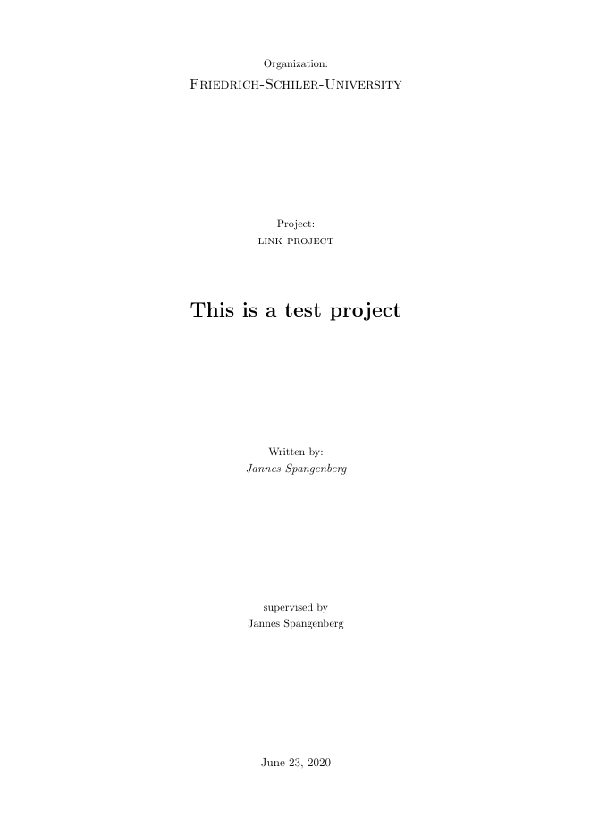

[](https://github.com/JannesSP/sciProTools)

# sciProTools
SCIence PROject TOOLS contains usefule python scripts for everyday science projects.

# Creator
Jannes Spangenberg<br>
Studying bioinformatics at Friedrich-Schiller-University in Jena Germany<br>

# Dependencies

*   [GitPython](https://gitpython.readthedocs.io/en/stable/)
    *   [Download on Conda](https://anaconda.org/conda-forge/gitpython)
*   [GPUtil](https://github.com/anderskm/gputil)
    *   [Download on Conda](https://anaconda.org/conda-forge/gputil)

## cProDir
cProDir can be used to create your project directory structure for better navigation and reproducibility in your projects.
This way uniformity is insured thoughout all your projects.
You have the possibility to link your resource data or to use a precreated empty git remote repository to add a version control to your project.

## Patch Notes
*   0.4 added latex project documents generation
*   0.3 connect your newly generated project to a precreated empty remote git repository like github

## Usage
<pre>
usage: cProDir.py [-h] (-p PROJECT_NAME | -g GIT_URL) [-pd SHORT_DESCRIPTION]
                  [-l PATH] [-ml TRAINDATA VALDATA] [-i LIST] [-a NAME]
                  [-s NAME] [-org NAME] [-oid ORCID] [-tex] [-sp] [-v]

cProDir.py helps you with Creating your PROject DIRectory with good structure
for better navigation and reproducibility.

optional arguments:
  -h, --help            show this help message and exit
  -p PROJECT_NAME, --project PROJECT_NAME
                        Name of the project you want to create locally.
  -g GIT_URL, --git GIT_URL
                        Use this argument if you already made an empty
                        repository and want to add your project to the remote
                        repository.
  -pd SHORT_DESCRIPTION, --project_description SHORT_DESCRIPTION
                        Short description about the project.
  -l PATH, --link PATH  Path of the folder of your resources/data. The linked
                        resources or data can be found in ./&ltproject&gt/res/.
  -ml TRAINDATA VALDATA, --machine_learning TRAINDATA VALDATA
                        Path to traindata and path to validationsdata. Data
                        gets linked into ./&ltproject&gt/res/ folder.
  -i LIST, --gitignore LIST
                        List of 'directories' or 'files' that should be
                        ignored in git version control. Only possible if -g is
                        used!
  -a NAME, --author NAME
                        Name of the author of the project.
  -s NAME, --supervisor NAME
                        Name of the supervisor.
  -org NAME, --organization NAME
                        Name of the organization.
  -oid ORCID, --orcid ORCID
                        ORCID of the author of the project. Should look like
                        XXXX-XXXX-XXXX-XXXX
  -tex, --latex         Use this parameter to generate latex files for project
                        work.
  -sp, --specs          Use this parameter to generate hardware specs in your
                        docfile.
  -v, --version         show program's version number and exit

You are currently using version 0.4!
</pre>

## Your project directory structure:
-   src: containing project scripts
-   res: containing project resources and data
-   bin: containing project binaries
-   lib: containing external libraries
-   doc: containing project documentation files
-   build: containing project binaries
-   temp: containing temporary files
-   out: containing output files, produced by processing/analyzing resources
-   out/plots: containing output plot files and diagrams

## Examples:

```sh
# Using precreated empty github repository, hard link resource data (only accessible locally) and add gitignore paths
python3 cProDir.py -g https://github.com/JannesSP/ml_project -ml ml_data/traindata ml_data/valdata -i 'res/*' -i '!res/README.md' -i '.gitignore'
# results: https://github.com/JannesSP/ml_project

# Create project locally and hard link resource data
python3 cProDir.py -p link_project -l link_data/

# Create project for machine learnling
python3 cProDir.py -p ml_project -ml ml_data/traindata ml_data/valdata

# Create project with latex
python3 cProDir.py -p link_project -l link_data/ -tex --author 'Jannes Spangenberg' --supervisor 'Jannes Spangenberg' -org 'Friedrich-Schiler-University' -pd 'This is a test project'
```
Latex title page created with the code above.
Click on the picture to see some other example pictures.
[](./img/)


