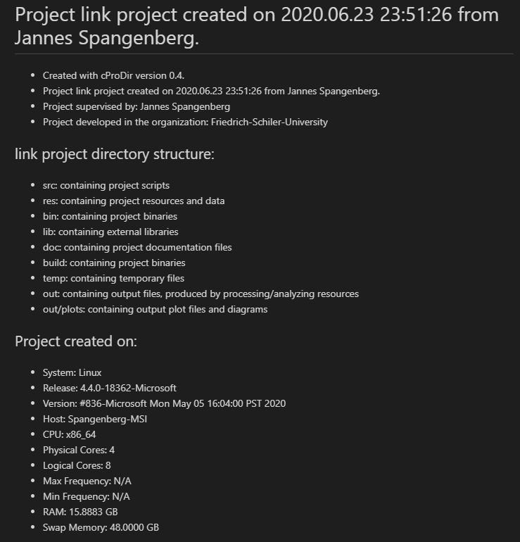
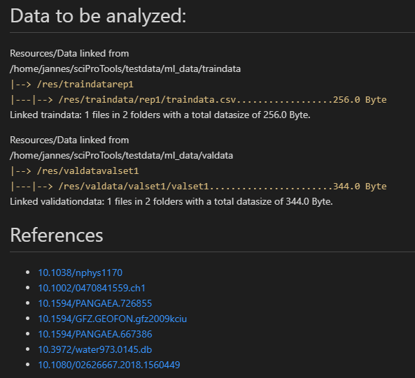
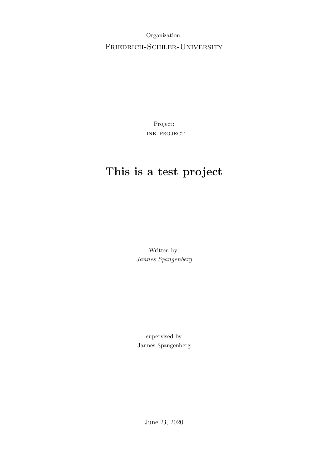
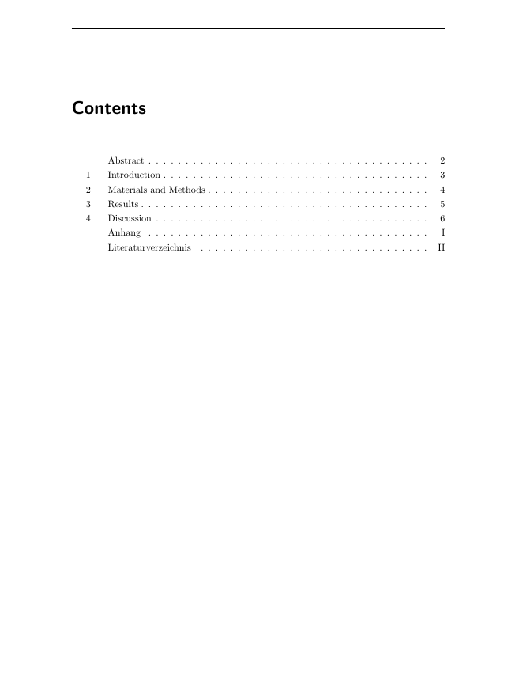

[](https://github.com/JannesSP/sciProTools)

# sciProTools 0.1
SCIence PROject TOOLS contains usefule python scripts for everyday science projects.
```Created with Python 3.7.7```

# Creator
Jannes Spangenberg<br>
Bioinformatics student at Friedrich-Schiller-University in Jena Germany<br>

# Dependencies

*   [GitPython](https://gitpython.readthedocs.io/en/stable/)
    *   [Download on Conda](https://anaconda.org/conda-forge/gitpython)
*   [GPUtil](https://github.com/anderskm/gputil)
    *   [Download on Conda](https://anaconda.org/conda-forge/gputil)

# createPro 0.5
createPro can be used to create your project directory structure for better navigation and reproducibility in your projects.
This way uniformity is insured throughout all your projects.
You have the possibility to link your resource data or to use a precreated empty git remote repository to add a version control to your project.
If you dont add a relative or absolute path or you are using git, the project will be created in your current working directory.

## Patch Notes
*   0.5
    * added option to add a DOI reference list that will be added to README.md
        * if used together with -tex, DOIs will be parsed to bibtex
*   0.4.2
    * fixed issue in orcid check
    * fixed path issue when using git
*   0.4.1
    * fixed issue in path creation
    * now using os.path.join()
*   0.4 
    * added latex project documents generation
    * additional information like author, supervisor, organisation, etc can be added
    * print the system specs in the README.md
*   0.3 
    * connect your newly generated project to a precreated empty remote git repository like github

## Usage

To get the usage page, execute ```python3 createPro.py -h```

## Your project directory structure:
-   src: containing project scripts
-   res: containing project resources and data
-   bin: containing project binaries
-   lib: containing external libraries
-   doc: containing project documentation files
-   doc/latex: containing latex scripts if you use -tex/--latex
-   build: containing project binaries
-   temp: containing temporary files
-   out: containing output files, produced by processing/analyzing resources
-   out/plots: containing output plot files and diagrams

## Examples:

```sh
# Using precreated empty github repository, hard link resource data (only accessible locally) and add gitignore paths
python3 createPro.py -g git_link -ml ml_data/traindata ml_data/valdata -i 'res/*' -i '!res/README.md' -i '.gitignore'

# Create project locally and hard link resource data
python3 createPro.py -p ./link_project -l link_data/

# Create project for machine learnling
python3 createPro.py -p ./ml_project -ml ml_data/traindata ml_data/valdata

# Create project and latex template
python3 createPro.py -p ./link_project -l link_data/ -tex --author 'Name' --supervisor 'Name' -org 'University' -pd 'This is a test project'

# Create project, latex template and add doi list as references
# references will be included in latex citations.bib and README.md als reference list
python3 createPro.py -p ./link_project -l link_data/ -tex --author 'Name' --supervisor 'Name' -org 'University' -pd 'This is a test project' -d DOI_FILE.txt

# add ORCID
python3 createPro.py -p ./link_project -l link_data/ -tex --author 'Name' --supervisor 'Name' -org 'University' -pd 'This is a test project' -oid XXXX-XXXX-XXXX-XXXX
```
## Pictures
Click on the picture to see some other example pictures.

### Information that will be prepared in your README.md

[](./img/)

[](./img/)

### Thumbnail of the pdf from the prepared latex scripts 

[](./img/)

[](./img/)

# plindocs 0.1
plindocs searches a given directory for plots and figures to be inserted into your documentation file.
Accepted plot formats are .png, .jpg, .jpeg and .eps.

## Patch Notes
*   0.1
    *   plots can be included in README.md and attachments.tex of a sciProTools project

## Examples
```sh
# Include plots from plot_dir into markown README.md of path_to_project
python3 plindocs.py -pl path_to_project -pr plot_dir -m

# Include plots from plot_dir into attachment.tex file of path_to_project
python3 plindocs.py -pl path_to_project -pr plot_dir -t
```